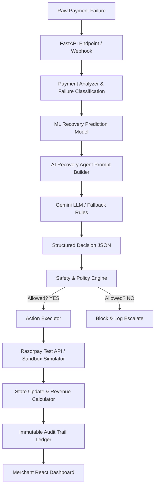

# System Architecture - RazorRecover AI

This document details the core component design and data flow of RazorRecover AI.

---

## Component Layers

### 1. API & Webhook Layer (`backend/app/api/endpoints.py`)
- Provides REST interfaces for the React dashboard and triggers backend actions synchronously or in the background.
- Simulates external webhook event processing (`/webhooks/razorpay`) when checkouts fail.

### 2. Failure Classification
- Maps raw, merchant-specific errors into high-level, actionable classes:
  - `TEMPORARY_BANK_FAILURE` (Gateway downtime, bank connectivity drops)
  - `NETWORK_FAILURE` / `TIMEOUT` (Checkout processing delays)
  - `INSUFFICIENT_FUNDS` (Cardholder credit limits)
  - `EXPIRED_CARD` (Card expired)
  - `CUSTOMER_ACTION_REQUIRED` (Incorrect pin, incomplete OTP)
  - `INVALID_CARD` / `PERMANENT_FAILURE` (Blocked cards, fraud triggers)

### 3. ML Prediction Model (`backend/app/ml/train.py`, `predict.py`)
- Standard RandomForest classifier trained on a high-fidelity synthetic transaction dataset of 10,000 rows.
- Predicts `recovery_probability` based on:
  - Error classification
  - Amount
  - Payment method
  - Retry count
  - Customer historical success rate

### 4. AI Agent Workflow (`backend/app/agents/ai_agent.py`)
- Formulates a reasoning prompt with transaction details, history, and the ML probability score.
- Queries the `gemini-1.5-flash` model requesting a structured JSON schema outlining:
  - `decision` (RETRY, NOTIFY_CUSTOMER, ESCALATE, STOP, etc.)
  - `strategy` (RETRY_AFTER_DELAY, UPDATE_CARD_LINK, SMS_NOTIFICATION)
  - `delay_minutes`
  - `explanation`
- Seamlessly falls back to deterministic rule analysis if no `GEMINI_API_KEY` is present.

### 5. Policy Engine Guardrails (`backend/app/policies/policy_engine.py`)
- The final validator. Checks AI actions against strict business invariants:
  - Max retries (hard limit = 3)
  - Recovery probability bounds (must be >= 50% for retries)
  - Blocking retries on expired or invalid cards to save processing fees and protect against bank fraud flagging.

### 6. Action Executor & Simulator (`backend/app/services/executor.py`, `razorpay_service.py`)
- Performs the approved recovery strategy.
- Simulates Razorpay Checkout Sandbox retries, invoice links, or notification sends.
- Calculates recovered revenue metrics dynamically and outputs immutable records into the `AuditLog` table.
